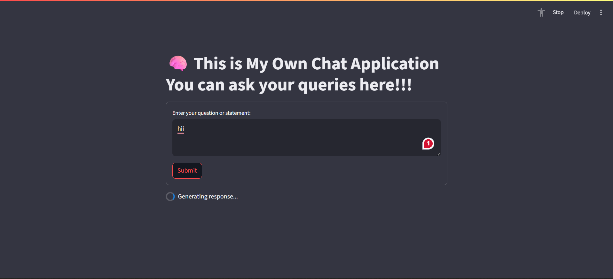

## 📸 Demo



# 🧠 Azure OpenAI Chat Application

A modern, responsive chatbot interface built with **Streamlit** and powered by **Azure OpenAI (GPT-4.1)**. This application replicates the ChatGPT-style experience, with clean UI, fixed input area, and seamless Azure backend integration.

---

## 🚀 Live Demo

🔗 [https://your-app-name.streamlit.app](https://intellichatbot.streamlit.app/)

> Replace the link with your Streamlit Cloud deployment.

---

## ✨ Features

- 🧠 Powered by Azure OpenAI (GPT-4.1)
- 💬 Scrollable chat window with fixed input box
- 🎨 Beautiful dark mode UI (custom CSS)
- 🗂️ Chat history using `st.session_state`
- ☁️ Easy to deploy on Streamlit Cloud or Azure

---

## 🛠 Tech Stack

- **Streamlit** – UI framework
- **Azure OpenAI Service** – GPT-4.1 via `azure.ai.inference`
- **Python** – Application logic
- **dotenv** – Environment configuration
- **CSS** – Custom responsive styling

---

## 📦 Setup Instructions

### 1. Clone the Repository

```bash
git clone https://github.com/your-username/azure-openai-chat.git
cd azure-openai-chat
